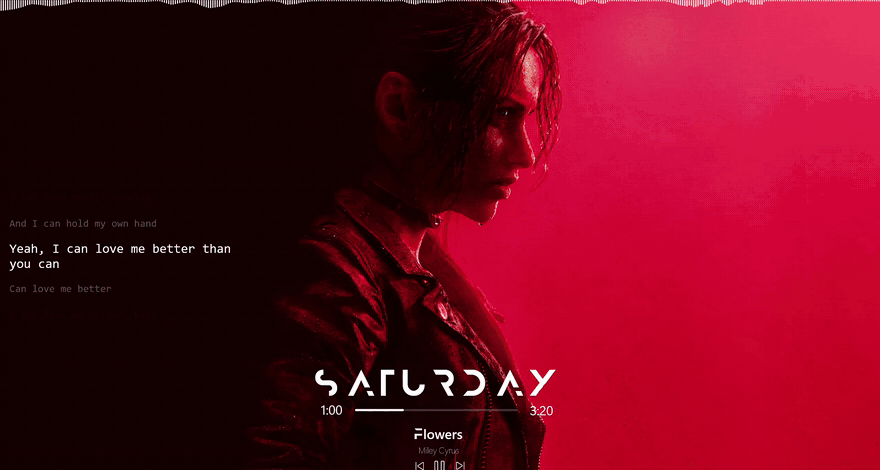

<p align="center"><picture><source media="(prefers-color-scheme: dark)" srcset="assets/deskbeat-dark.svg"></picture></p>

# Deskbeat

Desktop widgets for Spotify on Windows 11, in one small native app: a spectrum visualizer, synced lyrics, a clock, and a now-playing player.

<p align="center"></p>

<p align="center"><sub>Deskbeat on a real desktop, with Spotify playing.</sub></p>

[](https://github.com/akshit-bansal11/deskbeat/actions/workflows/ci.yml)
[](https://github.com/akshit-bansal11/deskbeat/releases/latest)
[](LICENSE)

It is built as a light alternative to a Rainmeter setup. Widgets redraw only when something changes, and nothing is drawn at all while Spotify is silent or a window covers the desktop.

**Website and documentation: [deskbeat.vercel.app](https://deskbeat.vercel.app).**

> Formerly Sonic Veil. Settings from that name are carried over the first time `deskbeat.exe` runs. What is and is not verified is listed under [What has and has not been tested](#what-has-and-has-not-been-tested).

## What you get

| Widget | What it shows |
| --- | --- |
| **Visualizer** | A spectrum of Spotify's audio only, not your games or calls. Bars, mirrored bars or a wave. |
| **Lyrics** | Time-synced lyrics, followed word by word where the song has timed words and line by line where it does not. What is being sung either lights up at once or fills as it is sung. Word timing comes from a LyricsPlus server and is never guessed. Line timing comes from [LRCLIB](https://lrclib.net). Cached on disk. A song with no lyrics shows nothing. |
| **Player** | Album art, title, artist, a progress bar you can click to seek, and previous, play/pause and next. |
| **Clock** | Day, time and date. |

There is no Spotify login and no client ID: track details and controls come from Windows itself, so it works on free accounts.

## Install

Download `Deskbeat-<version>.exe` from [Releases](https://github.com/akshit-bansal11/deskbeat/releases/latest) and run it. There is no installer. The exe is unsigned, so Windows SmartScreen will warn the first time: choose **More info**, then **Run anyway**.

It needs Windows 11 and the Spotify desktop app playing on the same PC. Playback sent to another device through Spotify Connect is not seen.

## Use

Deskbeat lives in the notification area. Double-click its icon for settings. Right-click it for a small menu: the version, a link to this repository, the start-with-Windows switch and Quit. The settings panel has those too.

| Hotkey | Does |
| --- | --- |
| `Ctrl+Alt+S` | Open settings |
| `Ctrl+Alt+E` | Edit layout: drag any element of the clock or player on its own, or drag the lyrics or visualizer to move them |
| `Ctrl+Alt+H` | Hide or show every widget |
| `Ctrl+Alt+Up` / `Down` | Show lyrics 100 ms earlier / later |

Hotkeys can be turned off in settings.

## Customise

The settings panel has a sidebar with a page for each widget, and each page is split into its parts: the clock into the widget, the day, the time and the date, the player into its art, title, artist, buttons, bar and both times. Every part has its own position, shown in the display's own pixels, on sliders notched at every quarter of the screen.

The player shows the name of the song alone, without the version, credits or film that Spotify appends (`player.short_title`), and never cuts it short.

The clock and the player have no box. In edit layout the day, time and date, and the player's art, title, artist, each button, the progress bar and both times can each be dragged anywhere; the one under the pointer is outlined. Nothing else is drawn in edit layout: no frames and no labels. Shift+click selects several elements, which then drag together. The space between elements does nothing, so nothing moves as a group unless you select it. The Player tab has two ready-made arrangements to start from.

Every piece of text has its own font, size, weight, colour, opacity, letter spacing and capitals setting. Each can also run across, down or up, with its letters upright or lying sideways: the day can stand as a column of upright letters, or be turned on its side like the spine of a book. In the file these are `direction` (`horizontal`, `down`, `up`) and `letters` (`upright`, `sideways`). The visualizer's bars have their own width and gap, which the number of bars does not change: bars that do not fit are left out. It can be turned a quarter to run down the side of the screen. The progress bar has a length, thickness and colour, the buttons a size and colour, and the album art a size and corner rounding.

Everything is stored in one file, which you can also edit by hand. It reloads when you save:

```
%APPDATA%\deskbeat\config.toml
```

To use a font without installing it in Windows, put its `.ttf` or `.otf` file in `%APPDATA%\deskbeat\fonts` and restart the app. The clock's day and time default to Anurati and Quicksand, the pairing the Mond Rainmeter skin uses; they are not shipped with the app, and the theme font is used until they are in that folder.

Every colour setting has a picker: the last chip in its row opens a colour square, a hue bar and a hex field you can type into.

The file takes a few things the panel does not: any installed font, and a hand-written clock format (`%H:%M`, `%l:%M %p`, `%A, %e %B` and so on).

Widgets can sit on the desktop under your windows (the default), behave like a normal window, or stay on top of everything.

## If a widget stays empty

Deskbeat has no console, so its diagnostics write to a file. In a terminal:

```
Deskbeat-1.3.0.exe --probe > probe.txt
```

With Spotify playing, this records for eight seconds what Windows reports about the track and how loud Spotify's audio is. Two more:

- `--probe-system` listens to everything the PC plays instead of Spotify alone.
- `--probe-lyrics "Title" "Artist"` looks one track up, for word timing and on LRCLIB.

Errors are logged to `%LOCALAPPDATA%\deskbeat\deskbeat.log`. The lyrics cache is in the same folder and is safe to delete.

## What has and has not been tested

Tested on a real Windows 11 desktop:

- All four widgets draw, sit on the desktop layer, and cost no CPU while idle.
- Lyrics lookup, title cleaning and the disk cache, against LRCLIB, and word timing from a LyricsPlus server.
- Audio capture, both for one app and for the whole system.
- Reading the track, position and album art from a running Spotify.
- An older config file loading with its sizes and fonts intact.

Checked only by automated tests and rendered snapshots, not by hand:

- The settings panel, the colour picker, dragging and multi-selecting elements in edit layout.
- The word-by-word fill staying in time with a song as it plays.
- The transport buttons and seeking.
- Staying visible through Show Desktop (`Win+D`).
- Settings carrying over from the Sonic Veil name.

Word timing depends on community-run LyricsPlus servers. When none answers, lyrics fall back to line timing from LRCLIB.

Memory use measured about 54 MB, above the 40 MB this was aiming for.

## Develop

The code is MIT-licensed, so you can build it, change it and run your own copy. To send a change back, fork the repository on GitHub, then clone your fork:

```powershell
git clone https://github.com/<you>/deskbeat.git
cd deskbeat
git remote add upstream https://github.com/akshit-bansal11/deskbeat.git   # to pull in later changes
```

| Path | What |
| --- | --- |
| `crates/core` | Pure logic with no Windows types: lyric parsing and timing, the sync clock, band mapping, colour, the config schema. Its tests run anywhere. |
| `crates/app` | The exe: windows, Direct2D drawing, the media session, audio capture, the settings panel. |
| `scripts/` | The quality gate. |
| `docs/` | [Architecture](docs/ARCHITECTURE.md). |
| `packaging/` | The winget manifest. |
| `site/` | The [website](site/README.md), with its own gate and workflow. |

### Prerequisites

Windows 11, the stable Rust toolchain (1.89 or later, with `rustfmt` and `clippy`) with the MSVC build tools, and PowerShell 7 (`pwsh`) for the gate.

### Quality gate

One script formats, lints and tests; CI runs the same script in its non-mutating mode, so the local gate and CI cannot disagree.

```powershell
pwsh scripts/check.ps1        # formats in place, then clippy (warnings are errors) and tests
pwsh scripts/check.ps1 -Ci    # what CI runs: fails on unformatted code instead of fixing it
```

### Run locally

- `cargo run --release` starts the tray app. Only one copy runs at a time, so quit a release build first.
- `cargo run --release -- --snapshot snapshots` renders every widget and the settings panel to PNG from made-up data, with no GPU or Spotify. It is how CI checks the drawing code, and the quickest way to see a visual change.
- `cargo test --workspace` runs the tests alone.

## Contributing

- **A bug, or something Deskbeat should do:** [open an issue](https://github.com/akshit-bansal11/deskbeat/issues/new/choose). The templates ask for what is needed to act on it. Open one before starting anything bigger than a fix.
- **A security hole:** report it privately, as [SECURITY.md](SECURITY.md) describes, not in a public issue.
- **A change:** make it on a branch of your fork, run the gate until it is clean, and open a pull request against `main` here. [CONTRIBUTING.md](CONTRIBUTING.md) has the details.

Releases are built and published by the maintainer; [CHANGELOG.md](CHANGELOG.md) lists what each one changed.

## Support

Deskbeat is free and stays free. If it is useful to you and you would like to say so with money, there are three ways:

- **[Ko-fi](https://ko-fi.com/akshit_bansal11)**, from anywhere.
- **[PayPal](https://paypal.me/AkshitBansal141)**, from anywhere.
- **UPI**, from any UPI app in India: `artistbansal2004@okaxis`

A star, a bug report or telling someone about it helps as much.

## How it stays light

- **No webview and no runtime.** One Rust process drawing with Direct2D.
- **Event-driven.** The clock wakes once a minute, lyrics at the next line, the player once a second. The visualizer runs only while there is sound.
- **Nothing hidden is drawn.** A widget under a maximized or fullscreen window stops entirely.
- **Low-power GPU.** On a laptop with two GPUs it uses the integrated one.

## License

[MIT](LICENSE).

## Credits

- Line-timed lyrics come from [LRCLIB](https://lrclib.net). Word-timed lyrics come from community-run LyricsPlus servers.
- Built on [windows-rs](https://github.com/microsoft/windows-rs), [RustFFT](https://github.com/ejmahler/RustFFT), [serde](https://serde.rs) and [toml](https://github.com/toml-rs/toml), all MIT or Apache 2.0.
- The clock's default pairing, Anurati and Quicksand, follows the Mond Rainmeter skin. Neither font is distributed with Deskbeat.
- Spotify is a trademark of Spotify AB. Deskbeat is not affiliated with or endorsed by Spotify; it reads what Windows reports about the app that is playing.
